# 板载功能一览

## 点亮第一个 LED 灯

从框图可以得知，板载的人机交互设备包括**两个 LED 灯**和**一个蜂鸣器**。而这两个设备并没有直接连接到 ESP32 单片机上，而是连接到 AW9523 IO 拓展芯片上，这是因为 ESP32 的 IO 数有限，为了不影响核心板的可拓展性而设计的。

AW9523 芯片通过 I2C 总线和 ESP32 连接，共提供 8 个 IO 口，标记为 $\bullet\text{P0}\sim\bullet\text{P7}$ 以示区分（ESP32 的 IO 口标记为 $\text{IOx}$）。在 LED 附近可以看到标注 $\bullet\overline{\text{P6}}$ 和 $\bullet\overline{\text{P7}}$，这表示这两个 LED 连接到了拓展芯片的第 6、7 管脚（从 0 开始），上划线表示**低电平点亮**。同理，蜂鸣器 $\bullet\overline{\text{P4}}$ 表示低 4 管脚低电平开启。

如果是直接连接到 Arduino 的管脚，我们能通过 `pinMode` 设置管脚为**输出**，再使用 `digitalWrite` 设置管脚为**低电平**。不过，这里连接到的是拓展芯片，那要怎么办呢？

与外围芯片打交道，需要“驱动”，Arduino 开源社区已经为我们准备好了 AW9523 芯片的驱动，并且提供了一套**与 Arduino 完全相符的函数接口**。

!!! hint "如果出错了？"

    如果出错，请翻看本页底部的”疑难解答“章节。

### 安装 Adafruit AW9523 库
我们可以借助 Arduino IDE 自带的库管理工具来安装。

1. 依次点选 `工具`-`管理库`，并搜索 `AW9523`:

    

    点击安装，在弹出来的界面点击 `Install All`。

2. **打开 AW9523 自带例程**：依次点选 `文件`-`示例`-滚动到最下面-`Adafruit AW9523`-`blink_demo` 

    

    ==**需要有两处修改！**==，首先把 `LedPin` 的赋值修改为 `6` 或 `7`，然后把 `aw.begin(0x58)` 修改为 `aw.begin(0x5B)`，这是因为核心板上芯片地址为 `0x5B`。

3. **上传程序，并观察现象**：

    此时对应的 LED 应该会开始闪亮，如果没有开始闪烁，请打开串口监视器（波特率：115200)，==按下复位键==，观察输出是否正常 [^1]。

!!! Hint "不要忘记 `aw.begin(addr)`"

    `aw.begin(addr)` 为每个 AW9523 实例完成总线的初始化工作，如果不进行初始化，**功能将完全无法使用**！后续 `aw` 有关的代码也将无效。在复制到别的程序时，记得带上这句。

[^1]: 你能用板载的蜂鸣器做一个 C4 炸弹报警器吗？

## 疑难解答

### 关于 BusIO 的编译错误

如果报错信息中包含 `Adafruit BusIO` 库相关内容未找到，请在库管理界面中搜索 `BusIO` 查看是否安装。如果没有安装，请选择 `1.10.3` 版本 （即比当前最新版本 1.11 老一个版本）点击安装；如果已经安装，也可按照上述方法**降级**，这个是一个库的版本依赖的 BUG。

### 库管理器打开时提示下载列表失败

检查电脑的系统时间（一般在屏幕右下角）是否正确，某些电脑因为电池老化无法保持时间，错误的系统时间会导致访问服务器失败。
