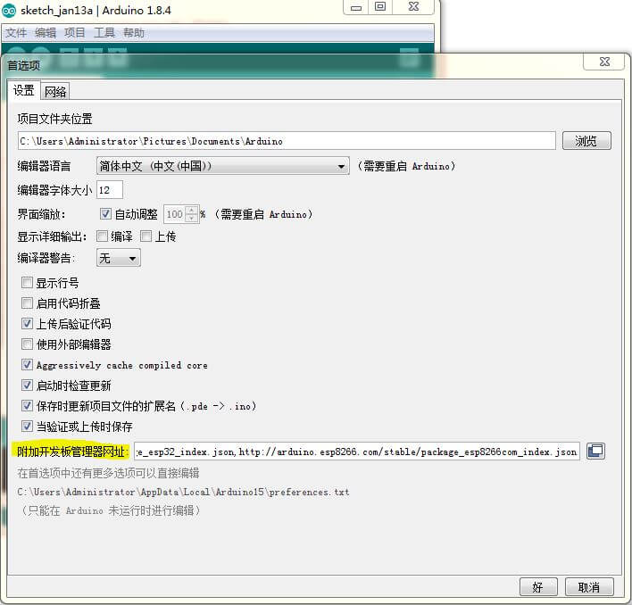
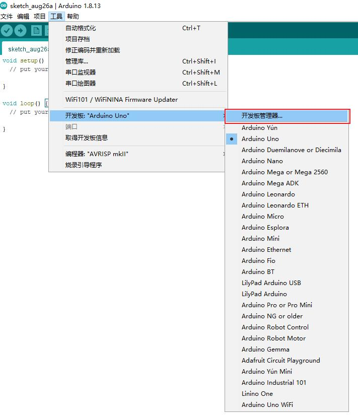
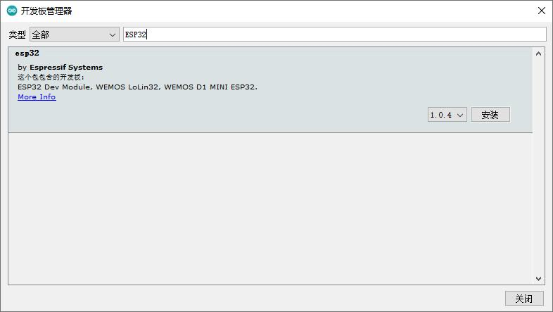
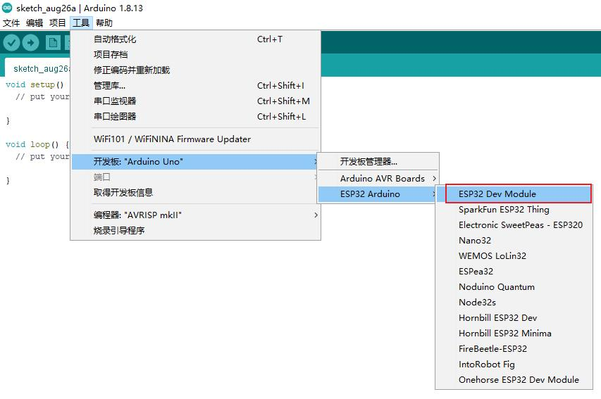
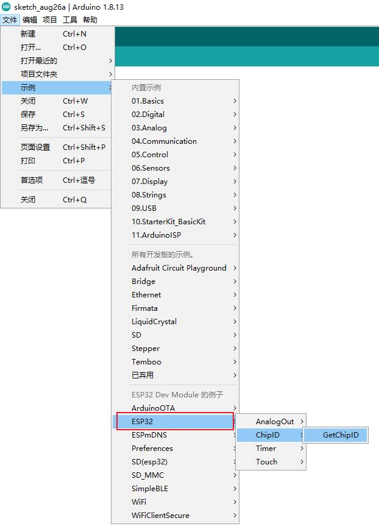
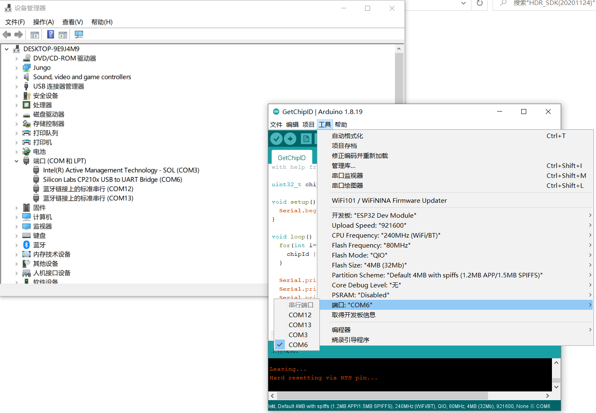
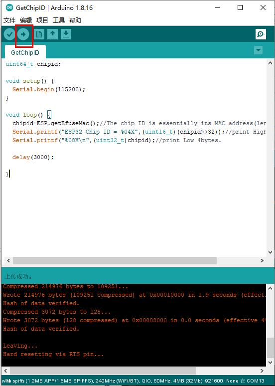
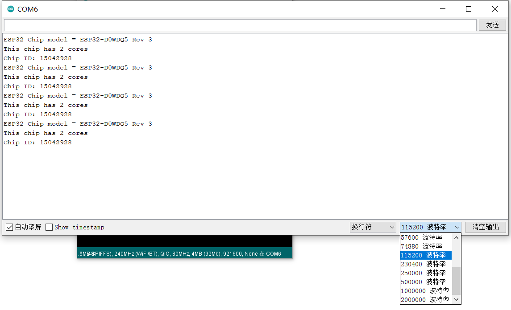

# 上手开局指南

## 安装 Arduino IDE

Arduino IDE 集成了编辑器、工具链管理、库管理、开发板管理和串口调试助手，适合于初学者。由于**缺少**代码补全和智能感知功能，我们推荐使用 VSCode + PlatformIO 作为进阶使用。


Arduino IDE 是跨平台软件，支持 Windows、MacOS 和 Linux。

### Windows 
下载 Arduino IDE 的安装包后，按照安装指引即可完成安装。

* [1.8.19 官网直链](https://downloads.arduino.cc/arduino-1.8.19-windows.exe){:target="_blank"}
* [1.8.19 北航云盘](https://bhpan.buaa.edu.cn:443/link/934A79B7E24422D8D5CA05A22EF906D2){:target="_blank"}

### MacOS
下载的压缩包解压得到 Arduino 应用，将其移动到 `应用程序` 目录下即可。

* [1.8.19 官网直链](https://downloads.arduino.cc/arduino-1.8.19-macosx.zip){:target="_blank"}
* [1.8.19 北航云盘](https://bhpan.buaa.edu.cn:443/link/934A79B7E24422D8D5CA05A22EF906D2){:target="_blank"}

### 其他系统 or 最新版本
请前往 [官网](https://www.arduino.cc/en/software){:target="_blank"} 自行下载。

!!! info ""

    截止 2022 年 4 月 7 日，Arduino IDE 最新的稳定版本为 `1.8.19`

## 添加 ESP32 开发板

Arduino IDE 默认不包含 ESP32 单片机，我们需要给它添加。

1. 在菜单栏依次选择 `文件`-`首选项`，打开首选项配置界面：

    

    在附加开发板管理器网址内填写 `http://10.134.118.207:8008/esp32.json` ，然后点击 `好`。

    !!! warning "此链接为校内镜像"

        网络上其他的教程一般会要求在此输入乐鑫官网的下载地址 `https://dl.espressif.com/dl/package_esp32_index.json`，但它要求从 Github 下载文件，在国内有连接不稳定的问题。因此我们搭建了校内镜像以减少大家的麻烦，同时也需要注意：**此链接在校外是无法工作的**。

1. 在菜单栏依次选择 `工具`-`开发板`-`开发板管理器`，搜索 `ESP32` 可以看到一个条目，点击`安装`：

    

    

1. 在菜单栏依次选择 `工具`-`开发板`，选择 `ESP32 Arduino`-`ESP32 Dev Module` 为开发板：

    

## 编译并上传 GetChipID 示例程序
为了测试我们的环境是否已经配置正确，我们可以使用 Arduino IDE 自带的示例程序来快速验证。

1. **打开示例程序**：在菜单栏依次选择 `示例`-`ESP32`-`ChipID`-`GetChipID`：

    

1. **使用 USB 线缆将开发板联机**：

    

1. **设置上传端口号**：

    通过 USB 线与电脑相连后，系统会给核心板分配一个端口号。在 Windows 上，可以通过**设备管理器**（在 Win10 下右键开始菜单图标可以看到）查看这个端口号；在 Linux 或 MacOS 上，可以通过 `ls /dev/tty` 命令，来查看所有的串口，并从中选择形如 `tty.usbserial` 的串口。

    

    !!! info "串口名称"

        核心板板载 `CP2102` USB 转串口芯片，因此载设备管理器中的名字为 `CP210x USB to UART`。如果没有发现这个设备：
        
        1. 请检查线缆是否连接正确，重新插拔一次；
        2. 核心板上是否有 LED 点亮，如不亮说明没有供电或板子坏；
        3. 没有安装 CP2102 驱动，设备管理器中显示为黄色感叹号，请 [下载](https://www.silabs.com/documents/public/software/CP210x_Windows_Drivers.zip){:target=_blank} 并安装。

1. **点击上传按钮**：

    

    Arduino IDE 会自动编译程序并上传到选定端口的 ESP32 上，核心板内置自动复位电路，但**由于我们的失误，在一部分电脑上无法自动上传**，==如反复出现上传超时报错，请使用手动上传==。

    !!! bug "自动上传失败的解决方法"

        当 Arduino IDE 下方深色背景的窗口中显示 `Connecting....` 时，==按住 IO0 按键==，出现上传进度时即可松开。
    
    我们注意到，在程序中有一行：

    ```c++
    Serial.begin(115200);
    ```

    其含义是使串口初始化，波特率设置为 115200。
        
1. **打开串口监视器查看结果**：

    上传完毕后，在 Arduino IDE 的右上角，有一个放大镜图标的按钮，即“串口监视器”，能显示核心板通过串口发送的数据，也能向它发送数据。

    必须设置准确的**波特率**才能显示正确的信息，否则数据会显示为乱码。调整的方法和调整完毕后预期的结果如下图所示：

    

    可以看到这个示例程序的功能即通过串口打印 ESP32 的芯片唯一 ID，**到此开局成功！**